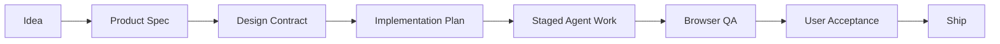

# VibeSpec

VibeSpec is a workflow layer for building normal, medium-sized apps and websites with AI coding agents.

It is not trying to be another AI app builder. The goal is to make vibe coding more reliable by turning a rough idea into clear product specs, staged implementation tasks, visible checkpoints, and explicit quality gates.

## Problem

Vibe coding is fast at the beginning, but medium-sized products often drift:

- The product idea is not converted into a clear PRD, feature spec, user flow, or acceptance criteria.
- The agent starts implementing too early, fills gaps freely, and the final result is not what the user wanted.
- Validation standards are vague, so the agent silently lowers the bar on UX, visual quality, edge cases, and engineering quality.
- Feedback only happens near the end, causing expensive rework.

## Product Direction

VibeSpec should become a **Vibecoding Product OS**:

The product sits above coding agents such as Codex, Claude Code, Cursor, Gemini CLI, Windsurf, and other AI coding tools. It defines what should be built, when the agent may proceed, and how each stage is verified.

## Core Workflow

1. **Define**: turn the idea into a product brief, PRD, target users, user journeys, feature list, non-goals, and MVP scope.
2. **Design**: create information architecture, page inventory, key flows, interaction states, visual direction, and a design contract.
3. **Plan**: break the spec into implementation phases, tasks, dependencies, risks, and verification commands.
4. **Build**: let the coding agent work phase by phase, with checkpoints instead of one long blind run.
5. **Verify**: run requirement coverage checks, browser QA, visual review, accessibility review, and user acceptance.

## MVP

The first version should focus on three high-leverage pieces:

- **Spec builder**: idea to PRD, feature spec, page list, user flow, and acceptance criteria.
- **Checkpoint workspace**: staged reviews for PRD, design, plan, implementation, and verification.
- **Quality gates**: product, design, engineering, browser QA, and final user acceptance checklists.

This avoids competing head-on with full-stack app builders and instead solves the control, clarity, and rework problems around them.

## What To Borrow From Existing Tools

The most useful references are:

- [GitHub Spec Kit](https://github.com/github/spec-kit): spec-driven development flow, constitution, clarification, checklists, and commands such as specify, plan, tasks, and implement.
- [Kiro Specs](https://kiro.dev/docs/specs/): requirements/design/tasks structure, spec tasks UI, and explicit separation between vibe mode and spec mode.
- [BMad Method](https://github.com/bmad-code-org/BMAD-METHOD): agentic agile roles such as PM, architect, UX, and developer, plus structured planning artifacts.
- [GSD Core](https://github.com/open-gsd/gsd-core): phase loop, planning artifacts, UI spec, verification workflow, and conversational UAT.
- [OpenSpec](https://github.com/Fission-AI/OpenSpec), [SpecDD](https://specdd.ai/), and [Colign](https://www.colign.co/): lightweight repo-local specs that can be read by multiple AI coding assistants.
- [Task Master AI](https://docs.task-master.dev/getting-started/quick-start/prd-quick): PRD to tasks, subtasks, and dependencies.
- [Lovable](https://docs.lovable.dev/), [Bolt](https://bolt.new/), [Replit Agent](https://docs.replit.com/references/agent/overview), [v0](https://v0.app/docs), [Firebase Studio](https://firebase.google.com/docs/studio/get-started-ai), and [Figma Make](https://developers.figma.com/docs/code/intro-to-figma-make/): fast generation, preview, point-and-edit interaction, deployment, and design-system aware prototyping.
- [Agent Skills](https://agentskills.io/) and [Claude Code Skills](https://code.claude.com/docs/en/skills): reusable workflow and capability packaging.

## Positioning

VibeSpec should not be just:

- a prompt pack,
- a task manager,
- a QA checklist,
- a wrapper around one coding agent,
- or another one-shot app generator.

The stronger opportunity is:

> a spec-first, checkpoint-driven workflow layer for turning AI-generated prototypes into product-quality apps.

## GSD Core Fit

GSD Core is a strong engineering workflow foundation. It already covers phase planning, execution, UI specs, verification, and UAT better than most vibe-coding setups.

But it does not fully cover VibeSpec's product goal:

- It is more of a CLI/repo-local development framework than a product definition workspace.
- Its PRD layer is useful but not deep enough for product strategy, user journeys, information architecture, competitive references, analytics, permissions, and release strategy.
- Its UI spec is a contract, not a visual exploration or high-fidelity design workspace.
- Its quality gates are strong for engineering correctness, but visual taste and product fit still depend heavily on the user.
- It does not provide a visual checkpoint dashboard for non-expert users.

The best relationship is:

> GSD Core can be a backend execution pattern or reference. VibeSpec should own the upstream product/design clarity and the visible review loop.

## Initial Roadmap

- Define VibeSpec's artifact model: brief, PRD, feature spec, design contract, implementation plan, verification report, UAT report.
- Build a template pack for common app/web types: SaaS, CRM, internal tools, marketplace, community, AI app, dashboard, content product.
- Create product/design/engineering review rubrics.
- Create a staged workflow that can drive existing coding agents.
- Add browser-based verification with screenshots, route checks, interaction checks, and visual review.
- Add a dashboard showing stage status, risks, unresolved decisions, requirement coverage, and user approvals.

## Status

This repository is currently an exploration repo. The first goal is to turn the concept into a concrete product spec and MVP plan.

## Notes

- [Research notes](docs/research-notes.md)
- [中文分析笔记](docs/analysis.zh-CN.md)
