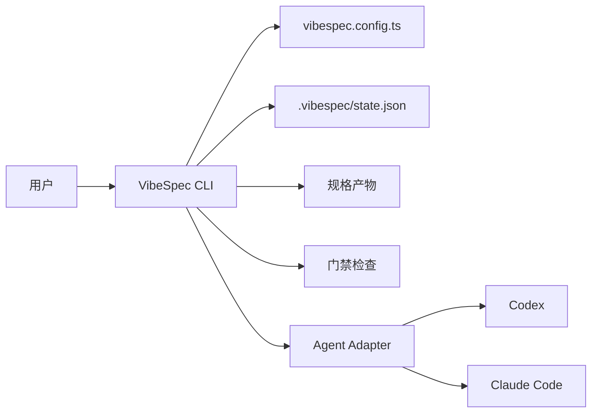
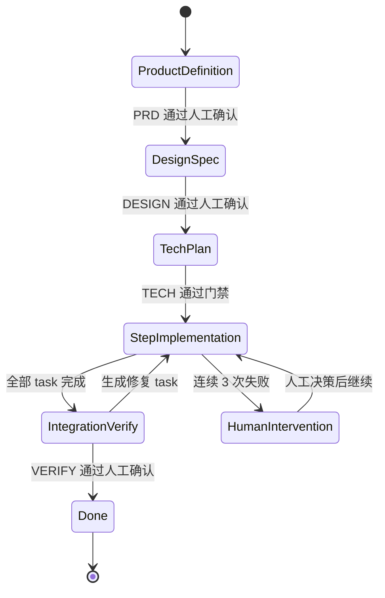

# VibeSpec 工作流规格

## 结论

VibeSpec 第一版采用 **TypeScript CLI + 配置文件 + 状态文件 + Agent workflow pack** 的形态。

核心定位是 agent-neutral：VibeSpec 不直接替代 coding agent，而是管理阶段、产物、门禁、状态和回退。第一版需要同时支持 Codex 和 Claude Code，后续再扩展到 Cursor、Gemini CLI、Windsurf 等工具。

## 设计目标

- 让 vibecoding 从一句话想法开始，也能逐步收敛到清晰规格。
- 在写代码前强制产出 PRD、设计规约和技术方案。
- 用状态机避免 agent 跳阶段、漏产物或一口气盲跑到底。
- 用门禁把“看起来完成了”改成有证据的 pass/fail 判断。
- 保持 CLI 足够轻，让 solo developer 可以在真实项目里快速试跑。

## 非目标

- 第一版不做完整 web dashboard。
- 第一版不做多人协作和权限系统。
- 第一版不做通用 app builder。
- 第一版不内置复杂项目管理系统。
- 第一版不强制绑定某一个 coding agent。

## 第一版架构

### CLI

CLI 负责：

- 初始化 VibeSpec 项目；
- 读取配置和状态；
- 推进阶段；
- 生成当前阶段提示词和 checklist；
- 执行门禁；
- 记录用户确认、失败次数和 override；
- 输出下一步动作。

### 配置文件

推荐文件名：`vibespec.config.ts`。

配置内容：

- 项目类型；
- 默认 agent；
- 支持的 agent adapter；
- 产物路径；
- 阶段启用状态；
- 验证命令；
- 门禁策略；
- override 策略；
- task 粒度限制。

### 状态文件

推荐路径：`.vibespec/state.json`。

状态文件记录：

- 当前阶段；
- 每个阶段是否完成；
- 每个阶段的产物路径；
- 门禁结果；
- 用户确认记录；
- task 执行记录；
- 连续失败次数；
- override 记录；
- 下一步推荐动作。

### Agent Adapter

Agent adapter 负责把 VibeSpec 的阶段指令转成具体 agent 可执行的工作方式。

第一版至少支持：

- `codex`；
- `claude-code`。

Adapter 只负责执行方式差异，不改变 VibeSpec 的核心流程、产物和门禁规则。

## 五阶段状态机

## 阶段 1：产品定义

### 目标

把一句话想法转成可执行的产品需求文档。

### 输入

- 用户的一句话想法；
- 可选的背景资料、竞品链接、目标用户描述。

### Agent 角色

产品经理。

### 产物

`PRD.md`

建议包含：

- 产品目标；
- 目标用户；
- 核心场景；
- 用户旅程；
- P0/P1/P2 功能；
- 成功标准；
- 不做什么；
- 风险和未决问题。

### 门禁

人工确认。

用户确认前，不允许进入设计规约阶段。

### 反模式防御

- 不写代码；
- 不跳过边界讨论；
- 不擅自推断核心需求；
- 不把功能列表当成 PRD；
- 不在未确认 PRD 时生成实现任务。

## 阶段 2：设计规约

### 目标

把 PRD 转成页面、流程、交互状态和视觉方向的设计契约。

### 输入

- 已确认的 `PRD.md`。

### Agent 角色

产品设计师。

### 产物

`DESIGN.md`

建议包含：

- 信息架构；
- 路由表；
- 页面清单；
- 组件树；
- 核心用户流程；
- loading / empty / error / edge case 状态；
- 数据流向；
- 视觉方向；
- 响应式要求；
- 可访问性要求。

### 门禁

人工确认。

用户确认前，不允许进入技术方案阶段。

### 反模式防御

- 不写样式代码；
- 不跳过交互状态；
- 没有路由表不进入技术方案；
- 没有页面清单不进入技术方案；
- 不把“看起来现代”当成视觉方向。

## 阶段 3：技术方案

### 目标

把已确认的产品和设计规格转成可执行的技术方案。

### 输入

- 已确认的 `PRD.md`；
- 已确认的 `DESIGN.md`；
- 当前仓库上下文。

### Agent 角色

Tech Lead。

### 产物

`TECH.md`

建议包含：

- 技术栈；
- 目录结构；
- 数据模型；
- API 契约；
- 状态管理；
- 外部依赖；
- 安全和权限边界；
- 测试策略；
- 验证命令；
- 实现风险。

### 门禁

LLM checklist 自检。关键技术选择、数据模型和外部依赖可以要求人工确认。

### 反模式防御

- 不引入未验证依赖；
- 不跳过数据模型；
- 不跳过 API 契约；
- 目录结构必须对应设计规约；
- 验证命令必须可执行或明确说明原因。

## 阶段 4：分步实现

### 目标

把技术方案拆成独立 task，并让 coding agent 分阶段实现。

### 输入

- `PRD.md`；
- `DESIGN.md`；
- `TECH.md`；
- 当前代码仓库。

### Agent 角色

执行工程师。

### 产物

`TASKS.md`

每个 task 建议包含：

- task 目标；
- 输入上下文；
- 允许修改范围；
- 预期产出；
- 验证方式；
- 完成 summary。

### 门禁

每个 task 完成后自检。连续 3 次失败时进入人工介入。

### 反模式防御

- 不一次性改动过大范围；
- 不写 TODO 留坑；
- 不跨 task 随意跳转；
- 不忽略验证命令；
- 不在失败后无限自动重试。

## 阶段 5：集成验证

### 目标

确认实现结果真正满足 PRD、DESIGN 和 TECH。

### 输入

- 全部实现代码；
- `PRD.md`；
- `DESIGN.md`；
- `TECH.md`；
- task summary；
- 测试和浏览器验证结果。

### Agent 角色

QA 工程师。

### 产物

`VERIFY.md`

建议包含：

- 功能完整性；
- 需求覆盖；
- 页面和路由覆盖；
- 交互状态覆盖；
- 视觉一致性；
- 响应式检查；
- 可访问性检查；
- 浏览器 QA 证据；
- 自动化测试结果；
- 未解决问题；
- 修复 task。

### 门禁

人工确认。

通过后进入完成状态；不通过则生成修复 task，回到分步实现阶段。

### 反模式防御

- 不只给主观完成声明；
- 不跳过浏览器验证；
- 不忽略视觉和响应式问题；
- 不把测试通过等同于用户验收通过；
- 不隐藏未解决风险。

## 门禁类型

### 人工确认

用于产品定义、设计规约和集成验证。

适合判断：

- 产品方向是否正确；
- 体验是否符合预期；
- 视觉质量是否可接受；
- 最终结果是否能交付。

### LLM 自检

用于技术方案和单个 task 完成后。

适合判断：

- checklist 是否覆盖；
- 产物是否完整；
- 验证命令是否执行；
- 是否存在明显实现缺口。

### 人工介入

触发条件：

- 连续 3 次 task 失败；
- agent 判断需求冲突；
- 门禁无法自动判断；
- 需要用户做产品或技术取舍。

### Override

默认门禁不可跳过。确实需要跳过时，必须记录：

- override 阶段；
- override 原因；
- 操作人；
- 时间；
- 风险说明；
- 后续补偿动作。

## CLI 命令草案

### `vibespec init`

初始化配置文件、状态目录和默认产物目录。

### `vibespec status`

展示当前阶段、已完成产物、门禁状态、失败次数和下一步动作。

### `vibespec next`

推进到下一阶段。只有当前阶段门禁通过后才允许执行。

### `vibespec gate`

执行当前阶段门禁检查，并记录 pass/fail 结果。

### `vibespec run-task`

执行或生成当前 task 的 agent 指令。

### `vibespec verify`

执行集成验证，生成或更新 `VERIFY.md`。

### `vibespec override`

显式跳过某个门禁，并记录原因和风险。

## TypeScript 实现建议

第一版可以使用 TypeScript 实现 CLI：

- CLI framework：`commander` 或 `cac`；
- 配置加载：支持 `vibespec.config.ts`；
- schema 校验：`zod`；
- 文件系统：Node.js `fs/promises`；
- 状态文件：JSON；
- Markdown 产物：先用模板生成，后续再支持结构化 AST；
- 测试：Vitest；
- 打包：`tsx` 开发，后续用 `tsup` 或同类工具打包。

实现原则：

- 先做最小可跑通版本；
- 状态机逻辑和 agent adapter 分离；
- CLI 输出要清楚说明当前阶段、阻塞原因和下一步动作；
- 不为尚未接入的 agent 提前写复杂抽象。

## 第一版成功标准

- 能在一个空项目中执行 `vibespec init`。
- 能从 idea 生成并确认 `PRD.md`。
- 能基于 PRD 生成并确认 `DESIGN.md`。
- 能生成 `TECH.md` 并通过 checklist。
- 能生成 task 列表并逐个推进。
- 能记录 task 成功、失败和连续失败次数。
- 能生成 `VERIFY.md`。
- 能阻止未通过门禁的阶段跳转。
- 能通过 override 显式跳过门禁并留下记录。
- 能同时生成 Codex 和 Claude Code 可用的阶段指令。

## 下一步

1. 定义 `vibespec.config.ts` 的 schema。
2. 定义 `.vibespec/state.json` 的 schema。
3. 定义 artifact templates。
4. 定义 Codex adapter 和 Claude Code adapter 的最小输出格式。
5. 搭建 TypeScript CLI 项目骨架。
